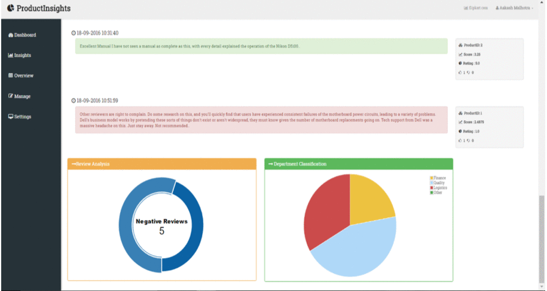
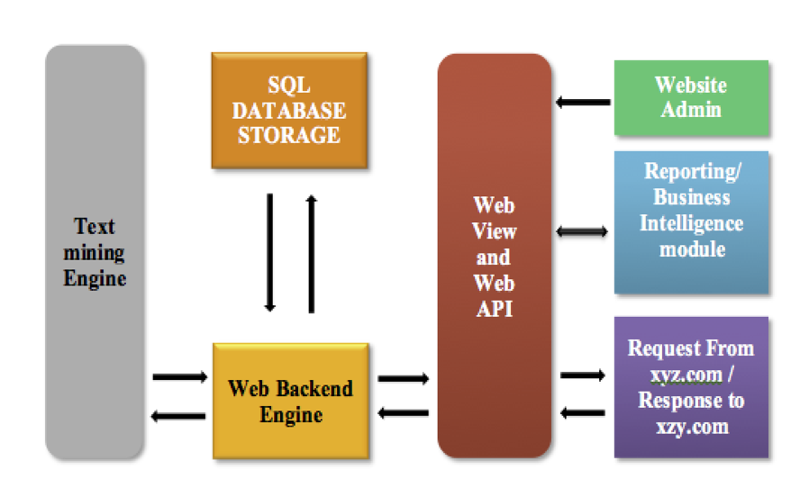

# Product Insights
A product review analyzer



## Abstract

The enormous growth and usage of e-commerce offer positive ways to any business by sharing the emotions, feelings and experiences. Web users are benefited with valuable online reviews. There are many instances, where these reviews are not considered for evaluation of a product in the market, thus affecting the sales of the products. Product Insights is a real-time web service which provides insights of the product by applying sentiment analysis on the reviews. It eases the way to manage bulk customer reviews and also simplifies handling of customer reviews with customizable workflow processes and meaningful graphs and charts. The goal is acknowledged by recognizing an arrangement of potential elements in the survey and by extricating feeling expressions about those elements by misusing their affiliations. The framework takes in the arrangement of critical relations to be utilized by reliance parsing and an edge parameter which permits us to combine intently related conclusion expressions. The affiliations are spoken to as a chart which is apportioned to at long last recover the sentiment expression portraying the client determined element.

## Architecture



This project is extended as a web hook to serve different e-commerce companies in the market. The interface is developed using ASP.NET and APIs are be provided to communicate with the service. A unique key will be generated for each client which acts as an identifier. The requests sent by the clients will be in JSON format and would comprise of:	
  - Review text, review id, product id etc. whenever a review is posted.
  - Up votes or down votes received for a review
  
 ```
    var authT = "32574A405023B09FFF6EE98D65727AFC";
    $("#butSubmit").on('click', function(e) {
      e.preventDefault();
      $.post("http://localhost:29611/Reviews/ReviewPost", {
        userID: $("#UserID").val(),
        reviewID: $("#ReviewId").val(),
        productID: $("#ProductId").val(),
        upvotes: 1,
        downvotes: 0,
        reviewerText: $("#Review").val(),
        rating: $("#Rating").val(),
        AuthToken: authT
      },
      function(data) {
        ...
      });
 ```

The collected data is be processed by the review classifier engine and the analysis drawn is visualized via graphs and charts. The interface is completely query based whereby which the clients have total control on the manner in which they wish to utilize/visualize the processed information.

The code-base for the sentiment analysis engine is located at .

A sample client which consumes the service is provided .

## License
MIT License.  See [the license](LICENSE) for more details.
